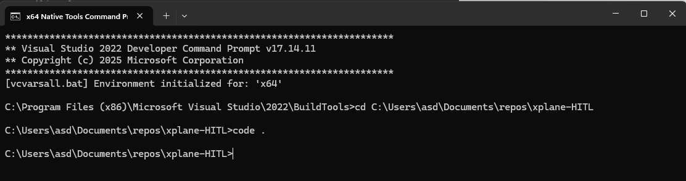
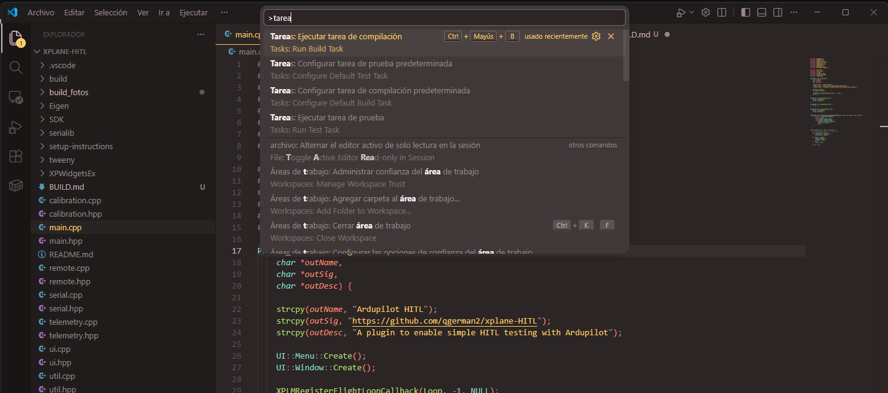
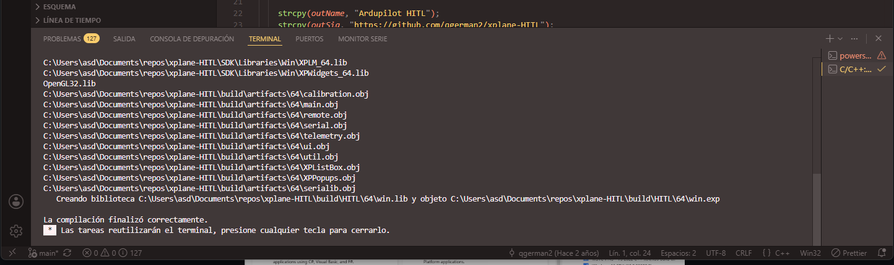

# Como compilar el proyecto

Prerequisitos

- VS Code
- Build Tools
    https://aka.ms/vs/stable/vs_BuildTools.exe, seleccionar Herramientas de desarrollo C++
- Esta repo

Compilar

1. Abrir shell de x64 Native Tools y dirigirse a la carpeta del repositorio, luego abrir VS Code con el comando "code ."
   

2. Presionar CTRL + SHIFT + P y seleccionar "Ejecutar tarea de compilación"
   

3. Si funciono se verá asi y quedara el plugin en la carpeta build
   