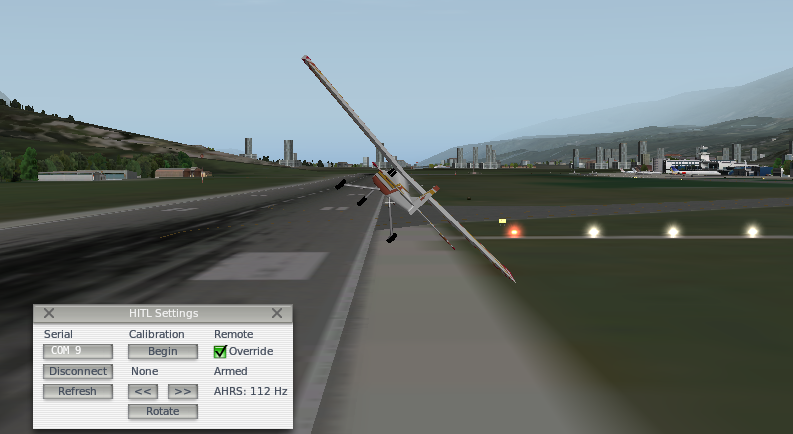
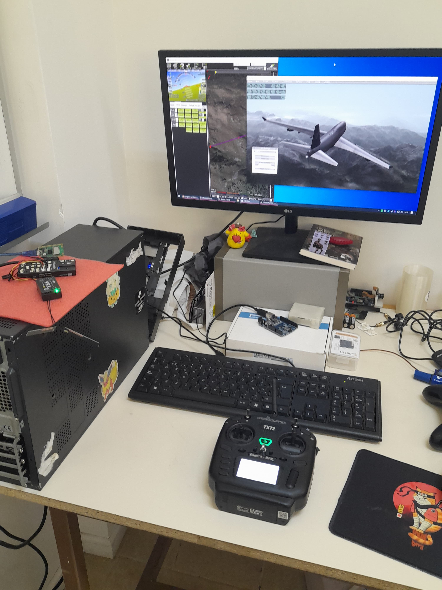

# X-Plane HITL Plug-in

This plug-in for X-Plane enables 'Hardware-in-the-Loop' testing with an autopilot running ArduPilot with a custom firmware.

### Features

- [x] Send plane state as telemetry from sensors.
- [x] Calibrate a plane sensors just as it's done with a real plane model.
- [x] Use any feature from Mission Planner as if it was working with a real plane model.
- [ ] Simulate sensor accuracy errors and interruptions.

It has been tested on X-Plane 9 and X-Plane 11, both 32 and 64 bit versions are provided as binaries.

## Setup

### 1. Download

Grab the [latest release](https://github.com/qgerman2/xplane-HITL/releases) and install it in the ```resources/plugins``` folder of X-Plane.

### 2. Configure an autopilot

Follow the instructions [here](https://github.com/qgerman2/ardupilot-HITL/blob/HITL/README.md) to flash an autopilot with the custom firmware required for the plug-in to work.

### 3. Set up the required parameters on Mission Planner

####  Parameters for Arduheli

| Parameter               | Value                                | Description                                                                                   |
| ----------------------- | ------------------------------------ | --------------------------------------------------------------------------------------------- |
| FS_THR_ENABLE           | 0                                    | Disable the radio safety switch                                                               |
| BRD_SAFETY_DEFLT        | 0                                    | Disable the vehicle safety switch                                                             |
| EAHRS_TYPE              | 3                                    | Use the custom ExternalAHRS library                                                           |
| SERIALX_PROTOCOL        | 36                                   | Set serial port as the External AHRS device that X-Plane connects to, SERIAL7 on the PixHawk4 |
| SERIALX_BAUD            | 115200                               | ExternalAHRS required baud speed                                                              |
| AHRS_EKF_TYPE           | 11 ExternalAHRS                      | Use X-Plane variables as state estimation                                                     |
| INS_ENABLE_MASK         | 1                                    | Disable other inertial systems                                                                |
| GPS_TYPE                | 21 ExternalAHRS                      | Set the main GPS as the external one                                                          |
| COMPASS_TYPEMASK        | * All marked except for ExternalAHRS | Disable the internal compass                                                                  |
| EFI_TYPE                | 7 Scripting                          | Enable the stub EFI implementation so that the EAHRS driver can update engine variables       |
| RPM1_TYPE               | 3                                    | Read RPMs from the EFI, requires to use the Search function on Parameters list to find it     |
| H_COL_ANG_MAX           | 13.5                                 | Max swashplate deflection of the cobra rc                                                     |
| H_COL_ANG_MIN           | 0                                    | Min swashplate deflection of the cobra rc                                                     |
| H_COL_MAX               | 1900                                 | PWM de maximo colectivo                                                                       |
| H_COL_MIN               | 1100                                 | PWM de minimo colectivo                                                                       |
| H_RSC_MODE              | 4                                    | Set ardupilot's throttle governor, requires RPM enabled                                       |
| H_RSC_THRCRV_0          | 42                                   | Curva de colectivo - throttle para mantener 1000 rpm                                          |
| H_RSC_THRCRV_25         | 54                                   | Curva de colectivo - throttle para mantener 1000 rpm                                          |
| H_RSC_THRCRV_50         | 74                                   | Curva de colectivo - throttle para mantener 1000 rpm                                          |
| H_RSC_THRCRV_75         | 95                                   | Curva de colectivo - throttle para mantener 1000 rpm                                          |
| H_RSC_THRCRV_100        | 100                                  | Curva de colectivo - throttle para mantener 1000 rpm                                          |
| H_RSC_GOV_RPM           | 1000                                 | Objetivo rpm del cobra rc                                                                     |
| H_RSC_GOV_RANGE         | 200                                  | Margen de rpm                                                                                 |
| H_SW_TYPE               | 1                                    | Set H1 non CCPM swashplate mode                                                               |
| H_COL2YAW               | -0.5                                 | Compensación de paso de helice de cola deacuerdo al colectivo heli cobra                      |
| ATC_HOVR_ROL_TRM        | -350                                 | Roll en hover para compensar torques de ambas helices                                         |
| AHRS_TRIM_Y             | 0.085                                | Pitch en hover para compensar drift                                                           |
| ATC_ANG_(PIT,RLL,YAW)_P | 10                                   | Ganancias proporcionales controlador PID                                                      |
| SERVO4_REVERSED         | 1                                    | Reverse yaw controls for the cobra rc                                                         |
| SCHED_LOOP_RATE         | 100                                  | Set 100hz sensor data rate                                                                    |

#### Bypass motor interlock

Helicopters require an extra safety switch to start and stop the engine called the motor interlock.
There is no parameter to disable this check so it needs to be disabled through a Lua script.

```lua
gcs:send_text(0, "Motor interlock bypass script started")

function update()
    if arming:is_armed() then
        rc:run_aux_function(32, 2)
    else
        rc:run_aux_function(32, 0)
    end
    return update, 1000
end

return update()
```

## Building the plug-in

The plug-in has been written in Visual Studio Code and compiled with the latest MSVC compiler, the tasks.json file contains the compiler parameters necessary and all dependencies are already included in the repository.

## Images



